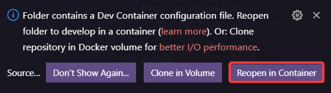

# Getting Started

## Prerequisites
* [Git](https://git-scm.com/)
* [Visual Studio Code](https://code.visualstudio.com/)
* If you are on Windows, install [WSL 2](https://docs.microsoft.com/en-us/windows/wsl/install-win10)
* [Docker](https://www.docker.com/)
  * **Windows**: [Docker for Windows](https://docs.docker.com/desktop/windows/install/) (select The **`WSL 2 Backend`** option)
  * **macOS**: [Docker for Mac](https://docs.docker.com/desktop/mac/install/)
  * **Linux**: [Docker CE/EE](https://docs.docker.com/install/#supported-platforms) 18.06+ and [Docker Compose](https://docs.docker.com/compose/install) 1.21+. (The Ubuntu snap package is not supported.)

## Installation
1. Install the [Remote Development extension pack](https://aka.ms/vscode-remote/download/extension) in Visual Studio Code.
1. Clone this repository to your local machine using git.
1. Open a command prompt and navigate to the root of the repository.
1. Please open this repo in Visual Studio Code using `code .` in the command prompt.
1. Once the folder is loaded, please click on the **`Reopen in Container`**-button as shown below:

1. Everything should be ready after the window loaded again. Make sure to open the Container each time you want to work on the project.

## Running the application
* Use `make dev` to start the development environment.
* Use `make build-dev` to build the development environment.
  > WARNING: `make build-dev` will automatically build all images in parallel. For low-end systems, or systems with troublesome heat dissipation, such as laptops, we recommend using `make build-dev-noparallel` in order to prevent overheating or crashing.
* Use `make down` do stop the development environment.
